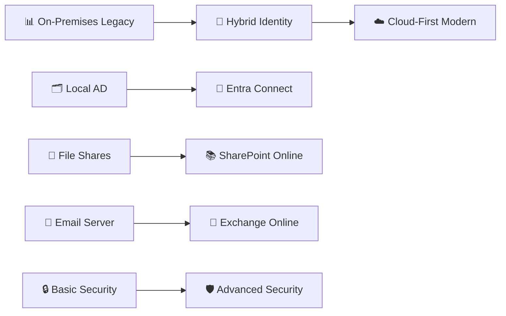

# 🌉 CloudBridge Identity Migration
## Hybrid Identity and Microsoft 365 Cloud Migration Project


## 🎯 Project Overview

> **Mission Statement**: Transform a traditional on-premises Active Directory environment into a modern hybrid cloud infrastructure supporting 20 users with enterprise-grade security and collaboration capabilities.

### 🌟 Key Highlights

**🔄 Hybrid Identity Implementation**
- Microsoft Entra Connect/Cloud Sync integration
- Seamless single sign-on experience
- Password hash synchronization
- Directory synchronization monitoring

**☁️ Complete M365 Integration**
- Exchange Online for modern email
- Microsoft Teams for collaboration  
- SharePoint Online for document management
- Enterprise mobility and security features

**🔒 Enterprise Security**
- Multi-Factor Authentication (MFA)
- Conditional Access policies
- Self-Service Password Reset (SSPR)
- Privileged Identity Management (PIM)

**🤖 Automation & Monitoring**
- PowerShell automation scripts
- Microsoft Graph API integration
- Entra Connect Health monitoring
- Custom reporting dashboards

**📚 Production-Ready Documentation**
- Detailed implementation guides
- Troubleshooting procedures
- Best practices documentation
- Lessons learned compilation

---

## 💼 Business Scenario

### 🏢 Current Challenge
A growing small business with **20 employees** operating on traditional on-premises infrastructure needs to modernize to:

| Challenge | Solution |
|-----------|----------|
| 🏠 Remote work enablement | Hybrid cloud infrastructure |
| 🤝 Improve collaboration | Microsoft Teams & SharePoint |
| 🔐 Enhance security posture | Advanced threat protection |
| 💰 Reduce IT costs | Cloud-based services |
| 📈 Scale for future growth | Elastic cloud resources |

### 🌐 Domain Structure
- **On-Premises**: `nebulix.local`
- **Cloud**: `nebulix.com`

### 📊 User Distribution (20 Total)

```
👔 Executive: 2 users (1 Owner + 1 Executive Assistant)
💻 IT: 4 users (3 IT Specialists + 1 Global Admin service account)  
👥 HR: 4 users
💼 Finance: 4 users
📈 Sales: 6 users
```

### 🏗️ Organizational Unit Hierarchy

```
OU=Corp
├── OU=Users
│   ├── OU=Exec
│   ├── OU=IT  
│   ├── OU=HR
│   ├── OU=Finance
│   └── OU=Sales
├── OU=Groups
├── OU=ServiceAccounts
├── OU=Admins
└── OU=Devices
```

---

## 🏗️ Architecture

### 🔄 Migration Journey



### 📋 Current State vs Future State

**🏢 On-Premises (Before)**

```
┌─────────────────────────────────┐
│     Company Network             │
│                                 │
│  ┌─────────────┐               │
│  │Windows      │               │
│  │Server 2025  │               │
│  │             │               │
│  │• AD DS      │               │
│  │• DNS        │               │
│  │• 20 Users   │               │
│  └─────────────┘               │
│                                 │
└─────────────────────────────────┘
```

**☁️ Hybrid Cloud (After)**

```
┌─────────────────┐    ┌─────────────────────────────┐
│ On-Premises     │    │ Microsoft 365 Cloud         │
│                 │    │                             │
│ ┌─────────────┐ │    │ ┌─────────────────────────┐ │
│ │Windows      │ │    │ │ Microsoft Entra ID      │ │
│ │Server 2025  │◄┼────┼►│ (Azure AD)              │ │
│ │             │ │    │ │                         │ │
│ │• AD DS      │ │    │ │ ┌─────────────────────┐ │ │
│ │• DNS        │ │    │ │ │ Exchange Online     │ │ │
│ │• Entra      │ │    │ │ └─────────────────────┘ │ │
│ │  Connect    │ │    │ │ ┌─────────────────────┐ │ │
│ └─────────────┘ │    │ │ │ Teams & SharePoint  │ │ │
│                 │    │ │ └─────────────────────┘ │ │
└─────────────────┘    │ │ ┌─────────────────────┐ │ │
                       │ │ │ Security & MFA      │ │ │
                       │ │ └─────────────────────┘ │ │
                       │ └─────────────────────────┘ │
                       └─────────────────────────────┘
```

---

## 🛠️ Technologies Stack

### 💻 Infrastructure & Virtualization
| Component | Technology |
|-----------|------------|
| Hypervisor | VMware Workstation 17 |
| Server OS | Windows Server 2025 |
| Directory | Active Directory DS |

### ☁️ Cloud Services  
| Service | Plan |
|---------|------|
| Identity | Microsoft Entra ID (Premium P2) |
| Email | Exchange Online Plan 2 |
| Collaboration | Microsoft Teams (Premium) |
| Storage | SharePoint Online Plan 2 |

### 🔒 Security & Automation
- **MFA** via Conditional Access
- **SSPR** (Entra ID)  
- **PowerShell** + Microsoft Graph
- **Entra Connect Health** monitoring

---

## 📈 Project Phases

### 📊 Phase Completion Tracker

**Phase 1**: Lab Infrastructure Setup ✅  
**Phase 2**: Microsoft 365 Tenant Preparation ✅  
**Phase 3**: Hybrid Identity Configuration 🔄  
**Phase 4**: Cloud Services Integration ⏳  
**Phase 5**: Security Hardening ⏳  
**Phase 6**: Automation & Monitoring ⏳  
**Phase 7**: Documentation & Showcase ⏳

---

**🔧 Phase 1: Lab Infrastructure Setup**

### 🎯 Objectives
- Deploy Windows Server 2025 VM
- Configure Active Directory Domain Services and DNS
- Create organizational structure (OUs)
- Generate 20 user accounts aligned to roles
- Create core security groups

### 📦 Deliverables
- Fully functional AD domain with documented OU hierarchy
- DNS resolution working
- 20 users provisioned with consistent UPNs
- PowerShell user creation script
- Group-based licensing-ready groups

**⏱️ Time Estimate: 1–2 days**

---

**☁️ Phase 2: Microsoft 365 Tenant Preparation**

### 🎯 Objectives
- Configure M365 E5 Developer Tenant
- Verify custom domain (optional)
- Enable core cloud services
- Create baseline security groups and role assignments

### 📦 Deliverables
- Active M365 tenant
- Services enabled and configured
- Initial admin accounts setup
- Domain verification completed

**⏱️ Time Estimate: 1 day**

---

**🔄 Phase 3: Hybrid Identity Configuration**

### 🎯 Objectives
- Install Microsoft Entra Connect
- Configure synchronization settings and OU filtering
- Implement Password Hash Sync
- Validate user synchronization

### 📦 Deliverables
- Entra Connect installed & configured
- 20 users synchronized to cloud
- Sync verification completed
- Troubleshooting documentation

**⏱️ Time Estimate: 2–3 days**

---

**🌐 Phase 4: Cloud Services Integration**

### 🎯 Objectives
- Assign licenses via security groups
- Configure Exchange Online mailboxes
- Set up Teams and SharePoint
- Test end-user functionality

### 📦 Deliverables
- All users licensed and provisioned
- Email flow tested
- Teams channels created
- SharePoint sites configured

**⏱️ Time Estimate: 2 days**

---

**🛡️ Phase 5: Security Hardening**

### 🎯 Objectives
- Enable MFA for all users
- Configure Conditional Access policies
- Implement SSPR
- Document security improvements

### 📦 Deliverables
- MFA enforced for all users
- Conditional Access policies active
- SSPR configured and tested
- Security baseline documented

**⏱️ Time Estimate: 2–3 days**

---

**🤖 Phase 6: Automation & Monitoring**

### 🎯 Objectives
- PowerShell automation for provisioning
- Entra Connect Health monitoring
- Reporting dashboards
- Automate common admin tasks

### 📦 Deliverables
- User provisioning automation
- License management scripts
- Health monitoring configured
- Reporting dashboards

**⏱️ Time Estimate: 2–3 days**

---

**📚 Phase 7: Documentation & Showcase**

### 🎯 Objectives
- Comprehensive documentation
- Architecture diagrams
- Publish scripts and configs
- Presentation materials

### 📦 Deliverables
- Complete project documentation
- Organized GitHub repository
- PowerShell script library
- Lessons learned summary

**⏱️ Time Estimate: 2 days**

---

## 👥 Organizational Structure

### 🔧 Key Security Groups
| Group Name | Purpose |
|------------|---------|
| `SG-M365-E5-AllUsers` | License assignment |
| `SG-IT` | IT department permissions |
| `SG-HR` | HR department access |
| `SG-Finance` | Finance department access |
| `SG-Sales` | Sales department access |
| `SG-Exec` | Executive privileges |
| `SG-Admins` | Administrative access |

### 👑 Administrative Model
- **Service Account**: `svc-globaladmin` (OU=Admins, no daily use)
- **Just-in-Time Access**: Owner and key IT staff use PIM
- **Break-Glass Accounts**: 2 cloud-only accounts (excluded from CA)

### 📧 Sample UPN Structure
**Format**: `firstname.lastname@contoso.com`

---

## 🎓 Learning Objectives

### 💻 Technical Skills
<details>
<summary>Click to expand technical skills</summary>

- **Hybrid Identity Architecture**
  - Directory synchronization concepts
  - Identity lifecycle management
  - SSO implementation

- **Microsoft 365 Administration**
  - Tenant configuration and management
  - Service provisioning and licensing
  - User and group management

- **Active Directory Management**
  - OU design and implementation
  - Group Policy configuration
  - DNS and domain services

- **PowerShell Automation**
  - Microsoft Graph API usage
  - Bulk operations scripting
  - Automated provisioning workflows

- **Security Implementation**
  - Multi-factor authentication
  - Conditional access policies
  - Privileged access management

</details>

### 🤝 Professional Skills
<details>
<summary>Click to expand professional skills</summary>

- **Project Management**
  - Phase-based implementation
  - Risk assessment and mitigation
  - Stakeholder communication

- **Documentation**
  - Technical writing
  - Process documentation
  - Knowledge transfer

- **Problem Solving**
  - Troubleshooting methodologies
  - Root cause analysis
  - Solution optimization

- **Best Practices**
  - Industry standards adherence
  - Security compliance
  - Change management

</details>

---

## 📊 Success Metrics

### 🎯 Technical Metrics
| Metric | Target | Status |
|--------|--------|--------|
| User Sync Success | 100% (20/20) | 🟡 In Progress |
| Email Delivery | 100% success rate | ⏳ Pending |
| Security Compliance | All policies enforced | ⏳ Pending |
| Automation Coverage | 80% of tasks | ⏳ Pending |

### 📚 Learning Metrics
| Skill Area | Completion |
|------------|------------|
| Architecture Understanding | 🟢 Complete |
| Implementation Skills | 🟡 In Progress |
| Security Knowledge | ⏳ Pending |
| Automation Ability | ⏳ Pending |

---

## 🎯 Prerequisites

### 💻 Required Software
- [ ] VMware Workstation 17 (or equivalent)
- [ ] Windows Server 2025 ISO
- [ ] Microsoft 365 E5 Developer Tenant

### 💡 Required Knowledge
- [ ] Basic Active Directory concepts
- [ ] PowerShell fundamentals
- [ ] Networking basics
- [ ] Microsoft 365 services overview

### 🖥️ Hardware Requirements
- [ ] **RAM**: 16GB+ recommended
- [ ] **Storage**: 200GB+ available space
- [ ] **CPU**: Multi-core processor
- [ ] **Network**: Stable internet connection

---

## 🤝 Contributing

### 🔄 How to Contribute
1. **Fork** the repository
2. **Create** a feature branch
3. **Document** changes in `/docs/`
4. **Submit** a detailed pull request

### 📝 Areas for Contribution
- 🤖 Automation scripts
- 📊 Monitoring enhancements  
- 🔒 Security policy templates
- 🔧 Troubleshooting scenarios
- ⚡ Performance optimization guides

---

## 🏆 Project Outcomes

### 🎓 Skills Development
- ✅ **Enterprise-Ready Skills** in hybrid identity
- ✅ **Security Expertise** with modern Microsoft stack
- ✅ **Automation Proficiency** with PowerShell
- ✅ **Documentation Excellence**

### 💼 Career Benefits
- **Industry Recognition**: Modern cloud architecture experience
- **Practical Experience**: Hands-on enterprise scenarios
- **Portfolio Enhancement**: Demonstrable technical projects
- **Certification Preparation**: Microsoft 365 and Azure certifications

---

## 📞 Contact & Support

### 👨‍💼 Project Maintainer
**Himanshu Gandhi**
- 📧 **Email**: gandhi111000@hotmail.com
- 💼 **LinkedIn**: [himanshu-gandhi-891204160](https://www.linkedin.com/in/himanshu-gandhi-891204160/)
- 🐙 **GitHub**: [himanshu3024](https://github.com/himanshu3024)

### 🔗 Project Links
> 🚧 **Coming Soon**
> - 🌐 Live Demo Environment
> - 📖 Full Documentation Portal
> - 📊 Project Dashboard

---

<div align="center">

**⭐ Star this project if you found it helpful!**


</div>
