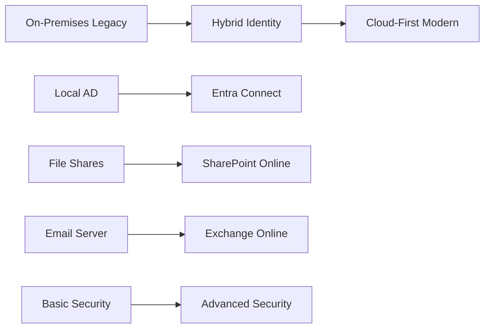

# 🌉 CloudBridge Identity Migration
> **Hybrid Identity and Microsoft 365 Cloud Migration Project**

[](https://github.com/yourusername/cloudbridge-identity-migration)
[](https://developer.microsoft.com/en-us/microsoft-365/dev-program)
[](https://www.microsoft.com/en-us/windows-server)
[](https://www.vmware.com/products/workstation-pro.html)

---

## 📋 Table of Contents
- [🎯 Project Overview](#-project-overview)
- [💼 Business Scenario](#-business-scenario)
- [🏗️ Architecture](#️-architecture)
- [🛠️ Technologies Stack](#️-technologies-stack)
- [📈 Project Phases](#-project-phases)
- [🎓 Learning Objectives](#-learning-objectives)
- [📊 Success Metrics](#-success-metrics)
- [🚀 Getting Started](#-getting-started)
- [📖 Documentation](#-documentation)
- [🤝 Contributing](#-contributing)

---

## 🎯 Project Overview

**CloudBridge Identity Migration** is a comprehensive hybrid identity and Microsoft 365 migration project that simulates a real-world enterprise scenario. This project demonstrates the complete migration journey from an on-premises Active Directory environment to a modern hybrid cloud infrastructure supporting **20 users**.

### 🌟 Key Highlights
- **Hybrid Identity Implementation** using Microsoft Entra Connect/Cloud Sync
- **Complete M365 Integration** with Exchange Online, Teams, and SharePoint
- **Enterprise Security** with MFA, Conditional Access, and SSPR
- **Automation & Monitoring** through PowerShell and Microsoft Graph
- **Production-Ready Documentation** with detailed implementation guides

---

## 💼 Business Scenario

Imagine a growing small business with 20 employees currently operating on a traditional on-premises infrastructure. The organization needs to:



**Business Drivers:**
- ✅ Enable remote work capabilities
- ✅ Improve collaboration and productivity
- ✅ Enhance security posture
- ✅ Reduce IT infrastructure costs
- ✅ Ensure scalability for future growth

---

## 🏗️ Architecture

### Current State vs Future State

<details>
<summary><strong>📊 Click to expand architecture diagrams</strong></summary>

### On-Premises (Before)
```
┌─────────────────────────────────┐
│     Company Network             │
│                                 │
│  ┌─────────────┐               │
│  │Windows      │               │
│  │Server 2025  │               │
│  │             │               │
│  │• AD DS      │               │
│  │• DNS        │               │
│  │• 20 Users   │               │
│  └─────────────┘               │
│                                 │
└─────────────────────────────────┘
```

### Hybrid Cloud (After)
```
┌─────────────────┐    ┌─────────────────────────────┐
│ On-Premises     │    │ Microsoft 365 Cloud        │
│                 │    │                             │
│ ┌─────────────┐ │    │ ┌─────────────────────────┐ │
│ │Windows      │ │    │ │ Microsoft Entra ID      │ │
│ │Server 2025  │◄┼────┼►│ (Azure AD)              │ │
│ │             │ │    │ │                         │ │
│ │• AD DS      │ │    │ │ ┌─────────────────────┐ │ │
│ │• DNS        │ │    │ │ │ Exchange Online     │ │ │
│ │• 20 Users   │ │    │ │ └─────────────────────┘ │ │
│ │• Entra      │ │    │ │ ┌─────────────────────┐ │ │
│ │  Connect    │ │    │ │ │ Teams & SharePoint  │ │ │
│ └─────────────┘ │    │ │ └─────────────────────┘ │ │
│                 │    │ │ ┌─────────────────────┐ │ │
└─────────────────┘    │ │ │ Security & MFA      │ │ │
                       │ │ └─────────────────────┘ │ │
                       │ └─────────────────────────┘ │
                       └─────────────────────────────┘
```

</details>

---

## 🛠️ Technologies Stack

### Infrastructure & Virtualization
| Component | Technology | Version | Purpose |
|-----------|------------|---------|---------|
| **Hypervisor** | VMware Workstation | 17 | Virtual lab environment |
| **Server OS** | Windows Server | 2025 | Domain controller & services |
| **Directory** | Active Directory | DS | On-premises identity store |

### Cloud Services
| Service | Platform | License | Function |
|---------|----------|---------|----------|
| **Identity** | Microsoft Entra ID | Premium P2 | Cloud identity management |
| **Email** | Exchange Online | Plan 2 | Cloud email & calendar |
| **Collaboration** | Microsoft Teams | Premium | Chat, meetings, files |
| **Storage** | SharePoint Online | Plan 2 | Document management |

### Security & Automation
| Tool | Purpose | Implementation |
|------|---------|----------------|
| **MFA** | Multi-factor authentication | Conditional Access |
| **SSPR** | Self-service password reset | Entra ID feature |
| **PowerShell** | Automation & scripting | Graph API integration |
| **Monitoring** | Health & sync status | Entra Connect Health |

---

## 📈 Project Phases

### Phase Completion Tracker
- [ ] **Phase 1:** Lab Infrastructure Setup
- [ ] **Phase 2:** Microsoft 365 Tenant Preparation  
- [ ] **Phase 3:** Hybrid Identity Configuration
- [ ] **Phase 4:** Cloud Services Integration
- [ ] **Phase 5:** Security Hardening
- [ ] **Phase 6:** Automation & Monitoring
- [ ] **Phase 7:** Documentation & Showcase

<details>
<summary><strong>🔍 Phase 1: Lab Infrastructure Setup</strong></summary>

**Objectives:**
- Deploy Windows Server 2025 virtual machine
- Configure Active Directory Domain Services
- Set up DNS server functionality
- Create organizational structure (OUs)
- Generate 20 test user accounts

**Deliverables:**
- ✅ Fully functional AD domain
- ✅ DNS resolution working
- ✅ 20 users in appropriate OUs
- ✅ PowerShell user creation script

**Time Estimate:** 1-2 days

</details>

<details>
<summary><strong>🔍 Phase 2: Microsoft 365 Tenant Preparation</strong></summary>

**Objectives:**
- Configure M365 E5 Developer Tenant
- Verify custom domain (optional)
- Enable core cloud services
- Create baseline security groups

**Deliverables:**
- ✅ Active M365 tenant
- ✅ Services enabled and configured
- ✅ Initial admin accounts setup
- ✅ Domain verification completed

**Time Estimate:** 1 day

</details>

<details>
<summary><strong>🔍 Phase 3: Hybrid Identity Configuration</strong></summary>

**Objectives:**
- Install Microsoft Entra Connect
- Configure synchronization settings
- Implement Password Hash Sync
- Validate user synchronization

**Deliverables:**
- ✅ Entra Connect installed & configured
- ✅ 20 users synchronized to cloud
- ✅ Sync verification completed
- ✅ Troubleshooting documentation

**Time Estimate:** 2-3 days

</details>

<details>
<summary><strong>🔍 Phase 4: Cloud Services Integration</strong></summary>

**Objectives:**
- Assign M365 licenses to users
- Configure Exchange Online mailboxes
- Set up Teams and SharePoint
- Test end-user functionality

**Deliverables:**
- ✅ All users licensed and provisioned
- ✅ Email flow tested
- ✅ Teams channels created
- ✅ SharePoint sites configured

**Time Estimate:** 2 days

</details>

<details>
<summary><strong>🔍 Phase 5: Security Hardening</strong></summary>

**Objectives:**
- Enable Multi-Factor Authentication
- Configure Conditional Access policies
- Implement Self-Service Password Reset
- Document security improvements

**Deliverables:**
- ✅ MFA enforced for all users
- ✅ Conditional Access policies active
- ✅ SSPR configured and tested
- ✅ Security baseline documented

**Time Estimate:** 2-3 days

</details>

<details>
<summary><strong>🔍 Phase 6: Automation & Monitoring</strong></summary>

**Objectives:**
- Create PowerShell automation scripts
- Set up Entra Connect Health monitoring
- Implement reporting mechanisms
- Automate common admin tasks

**Deliverables:**
- ✅ User provisioning automation
- ✅ License management scripts
- ✅ Health monitoring configured
- ✅ Reporting dashboards

**Time Estimate:** 2-3 days

</details>

<details>
<summary><strong>🔍 Phase 7: Documentation & Showcase</strong></summary>

**Objectives:**
- Create comprehensive documentation
- Develop architecture diagrams
- Publish scripts and configs
- Prepare presentation materials

**Deliverables:**
- ✅ Complete project documentation
- ✅ GitHub repository organized
- ✅ PowerShell script library
- ✅ Lessons learned summary

**Time Estimate:** 2 days

</details>

---

## 🎓 Learning Objectives

Upon completion of this project, I will have demonstrated proficiency in:

### Technical Skills
- ✅ **Hybrid Identity Architecture** - Understanding of on-premises and cloud identity integration
- ✅ **Microsoft 365 Administration** - Comprehensive experience with M365 services and licensing
- ✅ **Active Directory Management** - Advanced AD DS configuration and user management
- ✅ **PowerShell Automation** - Scripting for cloud and on-premises environments
- ✅ **Security Implementation** - Enterprise-grade security policies and controls

### Professional Skills
- ✅ **Project Management** - Structured approach to complex technical implementations
- ✅ **Documentation** - Professional-level technical writing and diagramming
- ✅ **Problem Solving** - Troubleshooting hybrid environments and integration issues
- ✅ **Best Practices** - Industry-standard approaches to cloud migration

---

## 📊 Success Metrics

### Technical Metrics
| Metric | Target | Measurement Method |
|--------|--------|-------------------|
| **User Sync Success** | 100% (20/20 users) | Entra Connect sync reports |
| **Email Delivery** | 100% success rate | Exchange Online transport logs |
| **Security Compliance** | All policies enforced | Compliance dashboard |
| **Automation Coverage** | 80% of tasks | PowerShell script inventory |

### Learning Metrics
| Objective | Evidence | Documentation |
|-----------|----------|---------------|
| **Architecture Understanding** | Complete diagram | `/docs/architecture.md` |
| **Implementation Skills** | Working environment | Phase completion logs |
| **Security Knowledge** | Policies configured | `/docs/security-guide.md` |
| **Automation Ability** | Scripts created | `/scripts/` directory |

---

## 🚀 Getting Started

### Prerequisites
- VMware Workstation 17 (or equivalent hypervisor)
- Microsoft 365 E5 Developer Tenant
- Windows Server 2025 ISO
- Basic knowledge of Active Directory and PowerShell


---


## 🤝 Contributing

This project is primarily for learning and demonstration purposes. However, if you'd like to suggest improvements or share similar experiences:

1. **Fork the repository**
2. **Create a feature branch** (`git checkout -b feature/improvement`)
3. **Document your changes** in the appropriate `/docs/` section
4. **Submit a pull request** with detailed description

### Areas for Contribution
- Additional automation scripts
- Enhanced monitoring solutions  
- Security policy templates
- Troubleshooting scenarios
- Performance optimization guides

---

## 🏆 Project Outcomes

Upon completion, this project will demonstrate:

> **Enterprise-Ready Skills**: Proven ability to design, implement, and manage hybrid cloud identity solutions at scale

> **Security Expertise**: Comprehensive understanding of modern identity security practices and Microsoft security stack

> **Automation Proficiency**: Advanced PowerShell scripting skills for cloud and hybrid environments

> **Documentation Excellence**: Professional-level technical documentation and project management capabilities

---

## 📞 Contact & Support

**Project Maintainer**: [Himanshu Gandhi]
- 📧 Email: [gandhi111000@hotmail.com]
- 💼 LinkedIn: [Your LinkedIn Profile]
- 🐙 GitHub: [@yourusername](https://github.com/himanshu3024)

**Project Links**:
- 🔗 [Live Demo Environment](https://demo.yourdomain.com) *(Coming Soon)*
- 📖 [Full Documentation](https://docs.yourdomain.com) *(Coming Soon)*
- 📊 [Project Dashboard](https://dashboard.yourdomain.com) *(Coming Soon)*

---

<div align="center">

**⭐ Star this repository if you find it helpful!**

[](https://github.com/yourusername/cloudbridge-identity-migration)
[](https://github.com/yourusername/cloudbridge-identity-migration/fork)

---

*This project is part of my professional development in Microsoft cloud technologies and enterprise identity management.*

</div>
